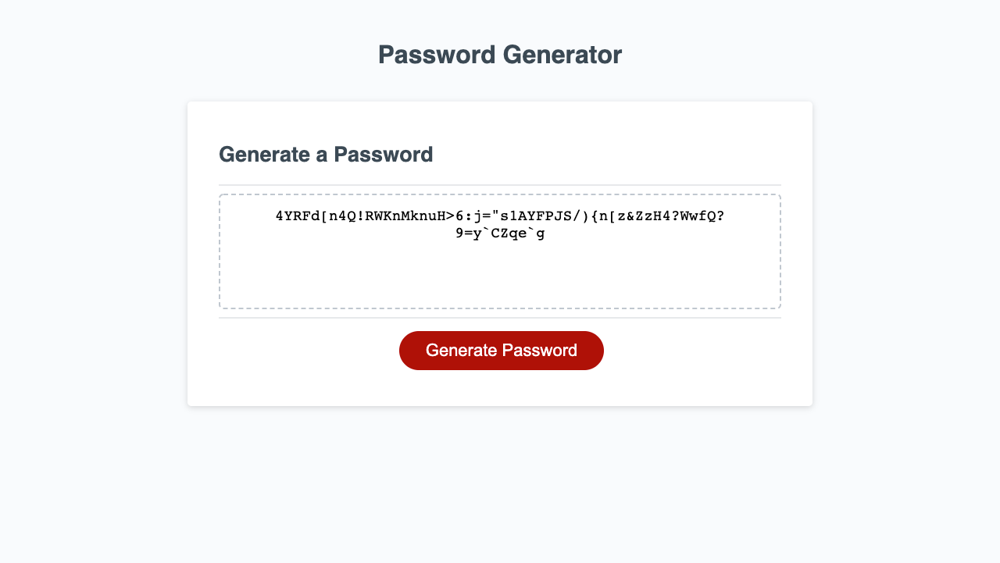

# The Random Password Generator

## Random passwords? What?

Yes, random passwords. Passwords at random. But only within the criteria you choose. It's very fancy.

This web gadget uses javascript to take the user through a series of prompts that determines the desired criteria for a randomized password, which it then prints on the page in the designated text area. The user can choose whether they want their password to have any combination of lower case letters, upper case letters, numbers, and symbols.

It works by storing all of the decided-on possible characters in one long string, then picking them at random an amount of times equal to the desired length. I was close to overcomplicating this one!

## Here's what it looks like:

It probably looks familiar, because I didn't change the layout. ;)

## Want your own very secure and impossible-to-remember password? Here:

### [Live Website](https://chrisaeus.github.io/Random-Password-Generator/)